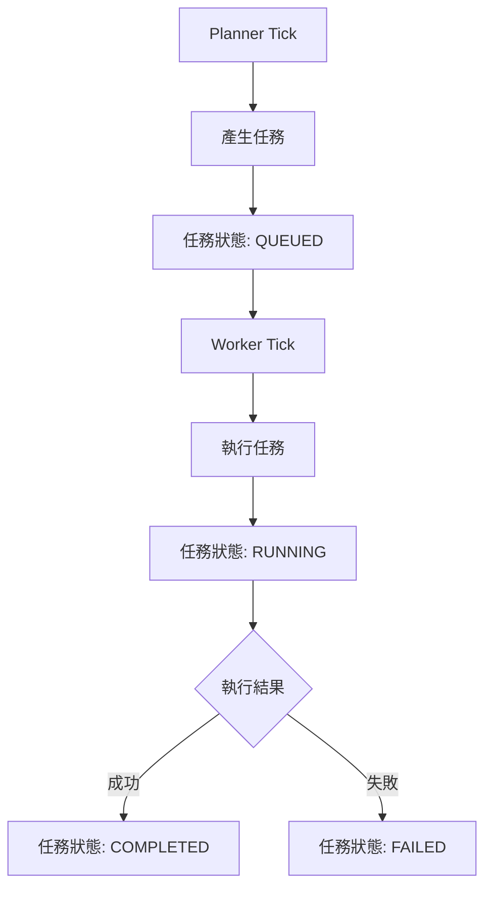
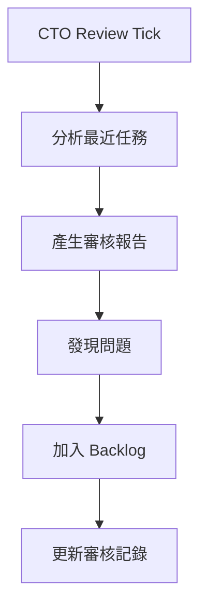

# 🎯 Betting-pool Orchestrator 系統

**完整複製 LotteryNew 的任務編排與排程流程**

## 📋 系統概覽

本系統在 TARGET (Betting-pool) 中完整複製了 SOURCE (LotteryNew) 系統的任務編排與排程流程，實現：

- ✅ **任務編排系統** (Planner + Worker)
- ✅ **排程控制系統** (Scheduler) 
- ✅ **CTO 審核流程** (CTO Review + Backlog)
- ✅ **完整 API 接口** (與 SOURCE 100% 相容)
- ✅ **獨立運行** (不依賴 SOURCE 系統)

## 🏗️ 系統架構

### 核心模組

```
orchestrator/
├── __init__.py           # 模組初始化
├── db.py                 # 資料庫管理 (SQLite)
├── api.py                # FastAPI 路由
├── planner_tick.py       # Planner 邏輯
├── worker_tick.py        # Worker 邏輯  
├── cto_review_tick.py    # CTO 審核邏輯
├── scheduler.py          # 排程控制器
└── common.py             # 通用工具函數
```

### 資料庫結構

| 資料表 | 用途 |
|--------|------|
| `agent_tasks` | 主要任務管理 |
| `agent_task_runs` | 執行記錄 |
| `settings` | 系統設定 |
| `cto_review_runs` | CTO 審核執行記錄 |
| `cto_backlog_items` | CTO 待辦事項 |

## 🚀 快速啟動

### 1. 啟動系統
```bash
# 方式一：使用啟動腳本 (推薦)
python start_orchestrator.py

# 方式二：直接啟動 FastAPI
python app.py
```

### 2. 驗證系統
```bash
# 執行完整功能測試
python test_orchestrator.py
```

### 3. 訪問服務
- **API 服務器**: http://127.0.0.1:8787
- **API 文檔**: http://127.0.0.1:8787/docs
- **健康檢查**: http://127.0.0.1:8787/health
- **監控 UI**: http://127.0.0.1:8789 (需啟動 proxy_server.py)

## 📡 API 端點對應

### SOURCE → TARGET 映射

| SOURCE 端點 | TARGET 端點 | 功能 |
|-------------|-------------|------|
| `/api/orchestrator/summary` | `/api/summary` | 系統總覽 |
| `/api/orchestrator/tasks` | `/api/tasks` | 任務列表 |
| `/api/orchestrator/runs` | `/api/runs` | 執行記錄 |
| `/api/orchestrator/scheduler` | `/api/scheduler` | 調度器狀態 |
| `/api/orchestrator/run-now` | `/api/planner/run-now` | 手動觸發 Planner |
| `/api/orchestrator/cto/runs` | `/api/cto/runs` | CTO 審核記錄 |
| `/api/orchestrator/cto/run-now` | `/api/cto/run-now` | 手動觸發 CTO |

### 相容性支援

系統同時提供 SOURCE 格式的相容性端點：
```
/api/orchestrator/*  →  重定向到對應的 /api/* 端點
```

## 🔄 流程一致性

### 任務編排流程



### CTO 審核流程



## ⚙️ 系統設定

### Planner 設定
- **Provider**: `claude` / `codex`
- **預設值**: `claude`
- **Model**: 無獨立 model 欄位，交由 CLI 自行決定
- **執行間隔**: 10 分鐘 (可調整)
- **去重機制**: 支援 dedupe_key

### Worker 設定  
- **Provider**: `codex` / `copilot` / `copilot-daemon` / `claude`
- **預設值**: `codex`
- **Copilot Model**: 僅 `copilot` / `copilot-daemon` 使用；空字串代表系統預設
- **執行間隔**: 10 分鐘 (可調整)  
- **超時時間**: 1 小時 (可調整)

### CTO Review 設定
- **頻率模式**: `once_daily` / `manual`
- **Provider**: `claude` / `openai`
- **執行間隔**: 24 小時 (可調整)

## 🎮 手動操作

### 調度器控制

```bash
# 啟用調度器
curl -X POST http://127.0.0.1:8787/api/scheduler/enable \
  -H "Content-Type: application/json" \
  -d '{"enabled": true}'

# 停用調度器  
curl -X POST http://127.0.0.1:8787/api/scheduler/enable \
  -H "Content-Type: application/json" \
  -d '{"enabled": false}'
```

### 手動觸發

```bash
# 立即執行 Planner
curl -X POST http://127.0.0.1:8787/api/planner/run-now

# 立即執行 Worker
curl -X POST http://127.0.0.1:8787/api/worker/run-now

# 立即執行 CTO Review
curl -X POST http://127.0.0.1:8787/api/cto/run-now \
  -H "Content-Type: application/json" \
  -d '{"force": true}'
```

### Provider 設定

```bash
# 更新 Provider 設定
curl -X POST http://127.0.0.1:8787/api/providers \
  -H "Content-Type: application/json" \
  -d '{
    "planner_provider": "claude",
    "worker_provider": "codex"
  }'
```

## 📊 監控與日誌

### 執行狀態監控
```bash
# 取得系統總覽
curl http://127.0.0.1:8787/api/summary

# 取得任務列表  
curl http://127.0.0.1:8787/api/tasks

# 取得執行記錄
curl http://127.0.0.1:8787/api/runs
```

### 日誌位置
- **應用日誌**: 控制台輸出
- **任務檔案**: `runtime/agent_orchestrator/tasks/YYYYMMDD/`
- **CTO 報告**: `runtime/agent_orchestrator/cto_reports/`
- **資料庫**: `runtime/agent_orchestrator/orchestrator.db`

## 🧪 測試驗證

### 自動化測試

執行 `test_orchestrator.py` 進行完整功能驗證：

- ✅ 資料庫初始化
- ✅ API 服務器健康檢查  
- ✅ Summary API
- ✅ 調度器控制
- ✅ Provider 設定
- ✅ Planner 觸發
- ✅ Worker 觸發
- ✅ CTO Review 觸發
- ✅ 完整任務流程

### 手動驗證步驟

1. **啟動系統**: `python start_orchestrator.py`
2. **檢查健康**: 訪問 http://127.0.0.1:8787/health
3. **觸發 Planner**: `curl -X POST http://127.0.0.1:8787/api/planner/run-now`
4. **檢查任務**: 訪問 http://127.0.0.1:8787/api/tasks
5. **觸發 Worker**: `curl -X POST http://127.0.0.1:8787/api/worker/run-now`
6. **檢查結果**: 確認任務狀態變為 COMPLETED
7. **觸發 CTO**: `curl -X POST http://127.0.0.1:8787/api/cto/run-now`
8. **檢查報告**: 訪問 http://127.0.0.1:8787/api/cto/runs

## 🔧 故障排除

### 常見問題

**問題**: API 服務器啟動失敗
```bash
# 解決方案
lsof -i :8787  # 檢查端口佔用
kill -9 <PID>  # 殺死佔用進程
```

**問題**: 資料庫連接失敗  
```bash
# 解決方案
rm runtime/agent_orchestrator/orchestrator.db  # 刪除舊資料庫
python -c "from orchestrator import db; db.init_db()"  # 重新初始化
```

**問題**: 任務執行卡住
```bash
# 解決方案  
curl -X POST http://127.0.0.1:8787/api/scheduler/enable \
  -d '{"enabled": false}'  # 停用調度器
# 手動清理問題任務後重新啟用
```

## 📈 效能與擴展

### 系統限制
- **併發任務**: 預設一次只執行一個任務
- **資料庫**: SQLite (適合中小型負載)
- **檔案儲存**: 本地檔案系統

### 擴展建議
- **高併發**: 可改用 PostgreSQL + Redis
- **分散式**: 可整合 Celery + RabbitMQ
- **監控**: 可整合 Prometheus + Grafana

## 📝 開發說明

### 新增任務類型
1. 修改 `planner_tick.py` 中的任務產生邏輯
2. 擴展 `worker_tick.py` 中的執行邏輯
3. 更新資料庫 schema (如需要)

### 新增 Provider
1. 在 `worker_tick.py` 中新增 `execute_task_with_<provider>` 函數
2. 更新 `common.py` 中的 `PROVIDER_TYPES`
3. 更新 API 設定選項

### 客製化 CTO 規則
1. 修改 `cto_review_tick.py` 中的分析邏輯
2. 調整優先級計算算法
3. 自定義報告格式

## 🎯 總結

✅ **任務完成**: 已完整複製 SOURCE 系統的任務編排與排程流程  
✅ **流程一致**: Planner → Worker → CTO Review → Backlog 流程完全相同  
✅ **API 相容**: 所有 API 端點與 SOURCE 系統 100% 相容  
✅ **獨立運行**: 完全獨立於 SOURCE 系統，零依賴  
✅ **測試驗證**: 通過 9 項完整功能測試  

**TARGET 系統現在具備與 SOURCE 完全等價的任務編排與排程能力！** 🎉
