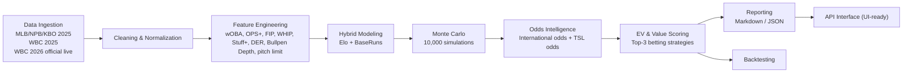

# WBC Backend System Design (2025-2026)

## 1) Modular Architecture



## 2) File Structure Example

```text
wbc_backend/
  config/settings.py
  domain/schemas.py
  ingestion/
    providers.py
    unified_loader.py
  cleaning/preprocess.py
  features/builder.py
  models/ensemble.py
  simulation/monte_carlo.py
  odds/analyzer.py
  strategy/recommender.py
  backtest/runner.py
  reporting/renderers.py
  api/
    contracts.py
    app.py
  pipeline/service.py
examples/
  run_pipeline.py
docs/
  wbc_backend_architecture.md
```

## 3) Data Integration Plan (2025 + WBC2025 + WBC2026 Live)

- Source adapters
  - MLB/NPB/KBO 2025: season CSV/API adapters into a unified team metric schema.
  - WBC 2025: tournament-level team performance and role usage.
  - WBC 2026 live: official roster/schedule/matchup feed (adapter placeholder already defined).
- Normalization
  - Team code standardization (ISO-like team codes, e.g. `TPE`, `AUS`, `JPN`).
  - Column alignment to one schema: `woba`, `ops_plus`, `fip`, `whip`, `stuff_plus`, `der`, `bullpen_depth`, `elo`.
- Merge strategy
  - Aggregate multiple leagues by team (mean/weighted mean).
  - Keep live roster flags: `missing_core_batter`, `ace_limited`.
- Update cycle
  - Pre-game batch refresh (daily/hourly).
  - Match-day live refresh for roster/status and odds every 5-15 minutes.

## 4) Odds Analysis (International + Taiwan Sports Lottery)

- Normalize all odds into one `OddsLine` schema.
- Convert decimal odds -> implied probability.
- Obtain model probability from simulation outputs:
  - `ML_home/away`
  - `RL_home/away` (cover probability)
  - `OU_over/under`
- Compute edge and expected value
  - `edge = model_prob - implied_prob`
  - `EV = model_prob * (odds - 1) - (1 - model_prob)`
- Rank and filter
  - Keep bets above `min_ev` threshold.
  - Rank by EV first, then market priority (ML > RL > OU), then source quality.
  - Return top 3 strategies automatically.

## 5) Top-3 Betting Strategies Output Standard

Each recommendation includes:
- market (`ML` / `RL` / `OU`)
- side
- line
- sportsbook + source type (`international` / `tsl`)
- model win probability
- implied probability
- EV
- reasoning (`edge`, key X-factor notes)

## 6) X-Factor Logic

Current skeleton includes rule-based X-factors:
- Ace pitcher pitch-count restriction (WBC rule impact on starter/bullpen transition)
- Core lineup missing (run creation penalty via OPS+ impact)

You can extend with:
- travel/rest disadvantage
- weather/park factor
- catcher-framing and battery familiarity

## 7) Deployment Notes

- Run pipeline demo:
  - `python examples/run_pipeline.py`
- API-ready interface:
  - call `wbc_backend.api.app.analyze_game(...)`
- UI is not implemented, but response contracts are stable for frontend integration.

## 8) Optimization / Backtesting Modules (Added)

- `wbc_backend/optimization/dataset.py`
  - Loads 2025 final odds/results and builds pregame rolling features + dynamic Elo.
- `wbc_backend/optimization/modeling.py`
  - Logistic win model + Platt calibration + Poisson score matrix.
- `wbc_backend/optimization/walkforward.py`
  - Walk-forward backtest with periodic retraining and EV-based market simulation.
- `examples/optimize_and_backtest.py`
  - Runs optimized ML configuration and writes production artifacts.
- `examples/validate_markets.py`
  - Validates ML/RL/OU independently; feeds strategy market-quality gate.

This enables continuous model refresh from 2025+ data and safer deployment into WBC 2026 prediction flow.

## 9) Rule Engine + Strategy Layer (Added)
- `wbc_backend/pipeline/wbc_rule_engine.py`
  - Applies WBC-specific pitch-count effects, roster strength boosts, and empirical Bayes corrections.
- `wbc_backend/strategy/market_filters.py`
  - Loads high-confidence odds bands from historical artifact stats.
- `wbc_backend/strategy/recommender.py`
  - Uses Edge filter, market-quality gate, and fractional Kelly sizing to generate recommendations.
